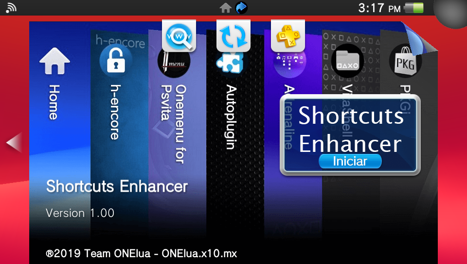
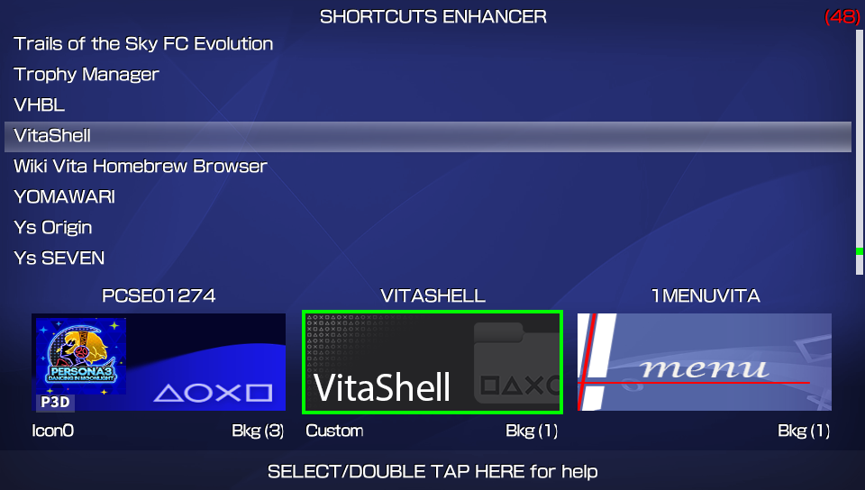
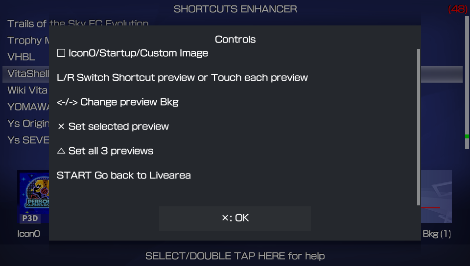

# Shortcuts Enhancer
**Simple app to enhance the shortcuts on the PS Vita index menu.**

**Based on QuickLaunch Installer by 1upus and IndexMenuMaker by Moody_Blues**

With this app, you can create custom images linked to any PS Vita app/game for the shortcuts shown in the PS Vita index menu, also, you can select between the icon or the startup image of your app/game to create the shrotcut preview.

When creating the preview images, you can choose between a bunch of colorfull backgrounds (when icon0 is selected, thanks to moody b) to make your shortcuts look the way you want them.

## Controls are as follows: ##

The front touch pad is enabled in this app for some functions :)
 
- Up/Down                   (Dir Pad)Scroll trough game/app list. 
- Right/Left                (Dir Pad)Change preview background. 
- R/L or Touch Pad          (Or tap the preview highlight it)Switch shortcut preview. 
- Square                    Switch between Icon0/Startup/Custom image. 
- Accept                    Set the selected preview to appear in the index menu (restart required). 
- Triangle                  Set all 3 previews to appear in the index menu (restart required). 
- SELECT or Touch Pad       (Or double tap at the bottom of the screen) To show controls menu 
- START                     Go back to Livearea (when doing changes a restart is needed for changes to take effect). 

Just in case you want to create your own images with PS or any other image editor, all you have to do is resize them to 282*108, rename them to the game id in upper case letters,save them as png format and place them in the following path 
*ux0:data/SHORTCUTS/1MENUVITA.PNG*  (as an example XD)

Also, if you want to use your own font for the previews you can place your font file at 
*ux0:data/SHORTCUTS/font/*

### Credits: ###

**u/CaSquall** for sharing their images in [Vitahacks]
(https://www.reddit.com/r/vitahacks/comments/arzjbn/vita_quicklaunch_setup_custom_icons_whatsnewxml/)

**IndexMenuMaker by Moody_Blues** https://hackusagi.hateblo.jp/entry/IndexMenuMaker

**QuickLaunch Installer by 1upus** https://github.com/1upus/QuickLaunch_installer_for_PSVita
